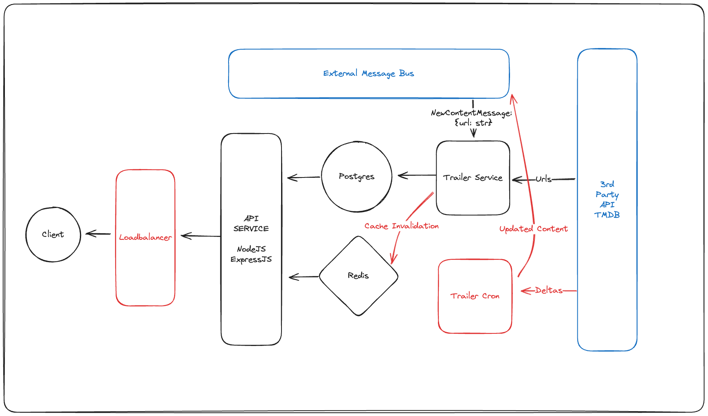
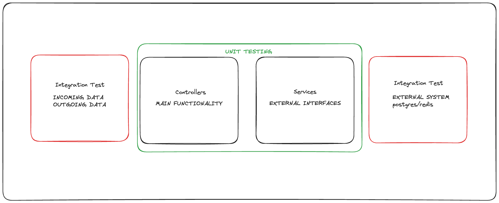

# Trailer Service System
The Trailer Service System, TSS, is used to obtain links for trailers. It uses TMDB as its primary source for trailer-links. 


## Overview
This system was designed with scale as its primary focus and how it would fit into a much bigger system, therefore, it may look a bit over-complex with regards to the simple task it performs. 

An important design decision I made is how data flows in the system. For a trailer to be available it first must have been onboarded to the system, therefore, just hitting the read-endpoint will not be enough to get the trailers. 

Instead the system builds on an event based architecture that requires other systems (within the same organization) to notify this system that new content is available. This is done via a message bus, our case SQS*.

_\* SQS is not enough in a real life scenario since we need fan-out. So the real setup would probably also include SNS._

## Shortcuts - Compromises
Since time is limited I needed to make some compromises:
* Left out some parts of the systems that are needed for a production system.
* Handling infrastructure, like SQS queue and databases with code instead of a real tool, like terraform. 
* Testing - I only added a test to one of two services - see later section for my thought process.
* Error Handling - I added error handling, however, I had no time to do edge-case testing, so we probably have some funky stuff going on if you hit this system with an edge-case.

But overall I am happy with what I achieved in the limited timeframe, which ended up to be around 7 hours.

## How to get started
You need docker, docker compose and for extra smoothness also postman.

Open `compose.yml` and enter your TMDB key as an environment variable in the trailer-service. (not super secure).

CD into project-root and run:
```
docker compose up 
```

Use the postman collection to check that everything is up and running by:

```
GET - health 
```

Next step is to migrate the database. I have added an endpoint for this. Irl we would not do it this way:
```
POST - migrate
```

Before you can actually get the urls the content needs to be onboarded. As you saw in previous sections the onboarding, or more specifically the decision on what to onboard is not the responsibility of this system.

To make it easier to test I added an endpoint that publishes a message to the SQS queue. This endpoint should not be in production.

Change the url-key in the body to try other urls.
```
POST - publish-new-content
```


Now you can retrieve the urls with the
```
GET - fetch-trailer
```

## Architecture
A quick overview of the architecture of the system, for a more in depth discussion about each part, see coming sections.



The parts marked with red have not been implemented but would be needed to get this system into production.

Blue parts are external dependencies. The SQS is spinned up by this project, but in production another system would own it.

### API
The api is the contact point with the client, which in this case would be a website or an app. The api has one responsibility:

* Returning urls for trailers

The api is stateless, so we can do horizontal scaling to meet peak traffic. 

Currently we are using a cache aside strategy for reading. Debatable if optimal.
### Trailer Service
The trailer service is responsible for "pre"-fetch trailers when new content is onboarded on the platform. So when the client request the trailers we already have them in our system. Look at the next section, `Design choices`, to understand why.

This is achieved by listening on the central-message-bus for "new-content"-events, that is published by the "content"-service.


I.e. when content-service (another internal service outside this system) onboards a new movie, it will also publish a message to the central-message-bus. Trailer-service is only one of the subscribers.

The trailer-service then hits several APIs to find the urls for the trailers, which we get from TMDB. The result is saved into postgres. 

To take this to production we would need to add a cache-invalidation step somewhere, maybe use write-through caching. 

Scaling is not a concern in this one, since we are ok with some eventual consistency and this system is unaffected by peak traffic from the users.

### Redis 
Redis is used for caching, and the majority of the reads will be from redis. An ok configured redis can handle over 100k requests per seconds, so this will scale really well.


The data is relatively small, since we will have at maximum 50 000 entries, where each payload is around 200-300 bytes (Key: 64 + ListOverhead: 40 + Urls: 200), the total will be less than 100 MB if I did the math correctly. This fits into memory without issues, so we can have all data in redis.

### Postgres
So, why do we have postgres, if all data can be stored in redis and will be served from there. That is a good question and I will acknowledge it may be a bit redundant. 

Postgres was added before I made the storage-calculations, as a backup when the cache couldn't handle the storage by itself. Now we know redis can handle this by itself and since redis has persistent storage it could also serve as our database.

Having postgres in the system would allow us to start implementing caching strategies like LRU, which right now is not needed right now. It also allows us to switch redis for a cache that does not support persistent storage, like memcache.


### Message Queue (External)
This message queue is "not" part of this "system". Instead it is some kind of central message-bus that is used by other services within ViaPlay.

The overall idea is that other services broadcast what they are doing, and whoever wants to listen in can do that.

In this case we listen to "new-content"-messages, which is a message that is published by the "content"-service when a new movie is added to the catalog.

A real life implementation would include SNS to achieve fan-out-pattern.

### Trailer Cron (Not implemented)
This was a service I did not have time to implement. It basically hits the TMDB api to get eventual changes that have been made to a movie.

This service is responsible for making sure the data is not stale. I.e. a new trailer was added to the movie or was removed due to some controversy. 

See the `not-implemented.md` file in the `/trailer-cron` directory if you are interested in a potential implementation.

## Design choices
### Storing Data vs Fetching Data from TMDB
There are several upsides, and some downsides, of storing the data vs getting it live from TMDB.

PROS: 
* Less dependency on 3rd party systems. I.e. If TMDB is down we can still serve our customers.
* Lower cost. The TMDB api is not free and to get the urls we need to make 2 requests.
* Lower latency. Removes 3 http-requests (viaplay url to imdb-id, imdb-id to id, id to url)
* Scalability. We will also spare TMDBs system during peak hours.


CONS:
* Cost of storage - neglectable in our case
* Risk of stale data - the trailer-cron is important here
* Complexity - needs extra infrastructure for this

In this case, the pros outweigh the cons by miles. 

### Hash of Url instead of IMDB-id as key
My initial thought was to have the imdb-id as a lookup key for the trailers. However, after some thought I realized it created an odd and unnecessary step in the flow, hitting viaplay to get the imdb-id from the content-url.

By using a hash of the content-url as the key, we remove one http-request (hitting the content url), which is better for latency of our system but also spares the other system.

We should save the raw-url somehow, right now, it’s hard to manually inspect the data since we only store hashes.


## Improvements
### Deployments for the trailer-service
The trailer-service would benefit a lot from deploying as a lambda. The pattern in new content is probably very "spiky", no new contents for days and then 100 new titles (due to some license stuff). By deploying it in lambda it will reduce the cost of idle-time + it would scale nicely if we there is a lot of incoming messages at the same time.

### Error handling
This system has some error handling, however, I do not feel I had the time to make it ready for production. There are most likely some odd interactions for edge cases that I have not accounted for. 

### Testing 
So I first want to acknowledge that I only added tests to the `trailer-api` and totally ignored the `trailer-service`, the reason is simple, I wanted to write fewer quality test so I can show you how I think about testing, rather than I can write a bunch of so-so test in a limited time. Also, as a small disclaimer, I am not saying the testing in `tailer-api` is perfect, it's hard to achieve good tests in 1 hour but I assume you get that.


The philosophy I tried to apply is to focus on _testing functionality, not implementation_. Even though the numbers of tests are low, I believe I made an ok good job getting coverage. Here is a visualization on how I thought about the testing. The red parts are not implemented.




#### Testing business logic
First we have the _business logic_. This system lacks business logic, but the closest we get is the `utils`-folder. This is the kind of logic that always should have high test-coverage. Bugs here are often "silent" and extremely hard to detect. I.e. The logic may produce an EBITDA that looks good but if off by 10%.

You should avoid mocking here and if you find yourself doing a lot of mocks, you may need to refactor the code. The interfaces of business logic should be simple-input, simple-output and isolated.


#### Testing the main functionality
Second is testing the functionality of the system, I tried to do this in the `controllers`-folder. The focus is to catch regression, this way we can detect bugs earlier and ensure previous functionality when we implement new functionality.
Since we are testing "functionality" we want to avoid testing "implementation", we will use mocks (or hard coded data) to draw clear boundaries on what we are testing. In the test I wrote I decided to mock `DatabaseService` and `CacheService`. 

The reasoning behind this is that the implementation of `DatabaseService` is very specific to postgres, and same goes for `CacheService` but for redis. However, Redis and Postgres are only one of many alternatives for caching and storage. In the future we may use other technologies for this purpose and then these tests would still be viable. I.e. Even if we change the cache-technology, we still want to hit the cache before we hit the database etc.


For the "other side" of the system we are testing input data by sending hardcoded data into the tests. Bad urls etc.

To ensure we implement "next" caching and database service correctly I used interfaces for these two services. Could argue for that we should use more interfaces. 

#### Testing implementation
Even though I said we should focus on testing _functionality over implementation_ we still need some implementation testing. Here you can see the `services` folder. It's simple tests just to make sure the services throws the right errors, returns the correct data etc.


### Integration Test
The unit test we added makes a good effort to ensure the functionality of the system, however, as always, this system is part of a bigger system so integration tests are needed to ensure our system adheres to the expectations of it, input/output etc.

I did not add integration tests since it's complex and time consuming to set up a test-environment for this. Database etc. 

### Imports
Using relatives imports as I have done here is very confusing. Instead we should use absolute imports. I should probably set it up correctly before coding which I didn't. 
